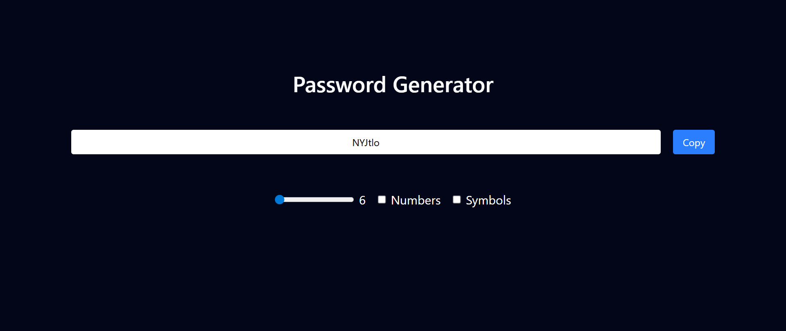

# 🔐 Password Generator (React)

A simple and customizable password generator built using React. Generate secure passwords with options for length, numbers, and special characters, and copy them instantly to your clipboard.

---

## 🚀 Features

- 🔢 Adjustable password length (6–100)
- 🔤 Includes uppercase & lowercase letters
- 🔢 Option to include numbers
- 🔣 Option to include symbols
- 📋 One-click copy to clipboard
- ✨ Auto-select password on copy
- ⚡ Instant password regeneration on settings change

---

## 🛠️ Tech Stack

- React (Hooks: useState, useEffect, useCallback, useRef)
- Tailwind CSS
- Vite

---

## 📸 Preview

---

## ⚙️ Installation & Setup

1. Clone the repository:
git clone https://github.com/tejasabhale/password-generator.git

2. Navigate to the project:
cd password-generator

3. Install dependencies:
npm install

4. Run the development server:
npm run dev

---

## 🧠 How It Works

- A character set is created based on user preferences (letters, numbers, symbols)
- A random password is generated using Math.random()
- useEffect triggers regeneration whenever options change
- useRef is used to select and copy the password input field

---

## 📂 Project Structure

src/
├── App.jsx
├── main.jsx
└── index.cs

---

## 🧩 Key Concepts Used

- React state management
- Controlled components
- Event handling (onChange, onClick)
- Clipboard API (navigator.clipboard)
- DOM manipulation using useRef

---

## 💡 Future Improvements

- Add strength indicator (Weak / Medium / Strong)
- Add password history
- Improve UI/UX with animations
- Better mobile responsiveness
- Toast notification on copy

---

## 🤝 Contributing

Feel free to fork this repo and submit pull requests for improvements!

---

## 📜 License

This project is open-source and available under the MIT License.

---

## 🙌 Acknowledgements

Built as a learning project to understand React hooks and UI interactions.